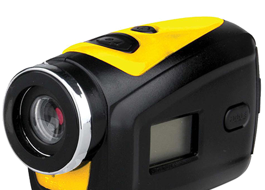
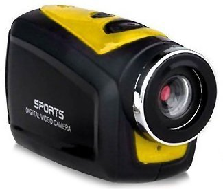
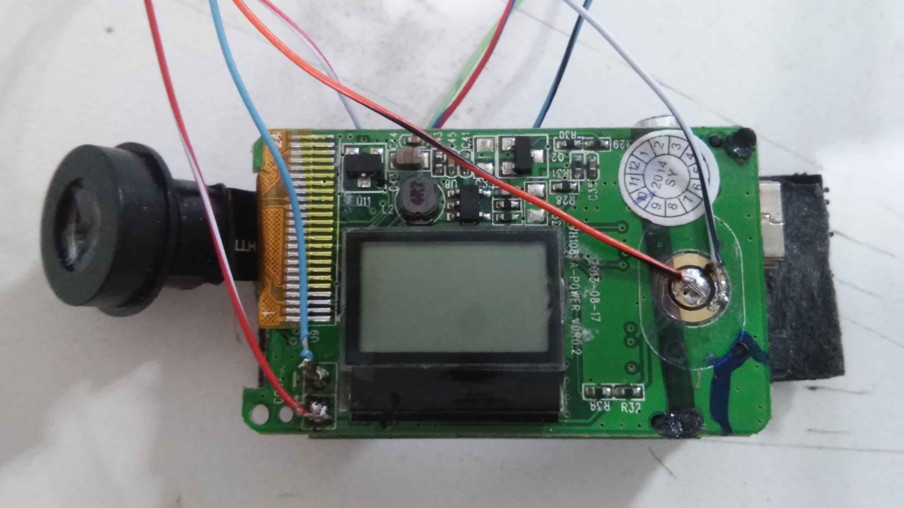
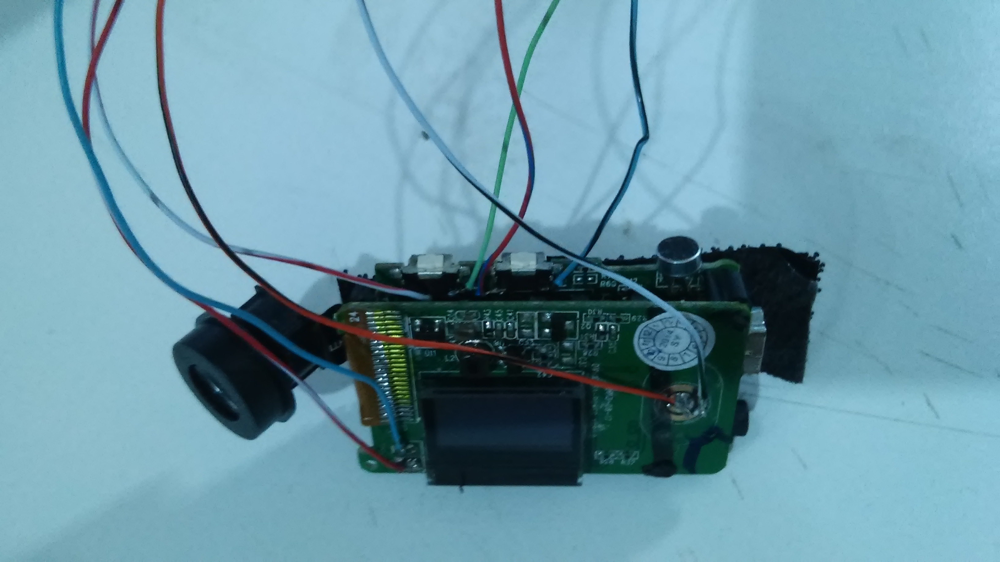
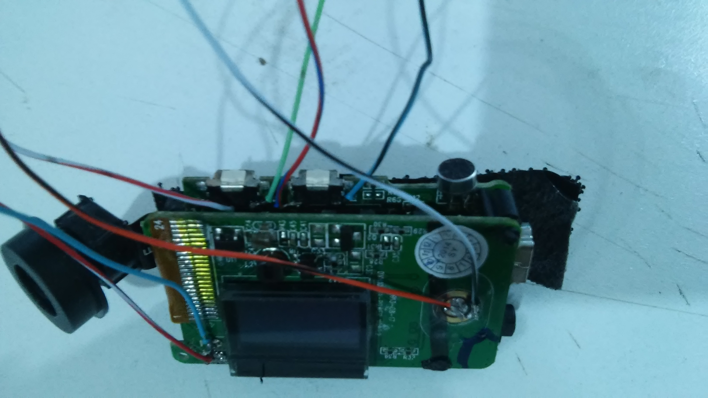
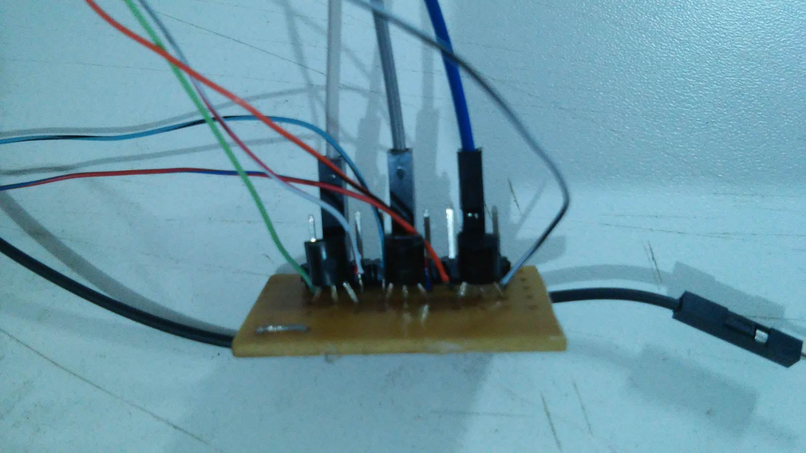
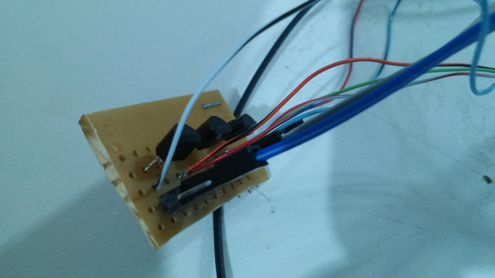
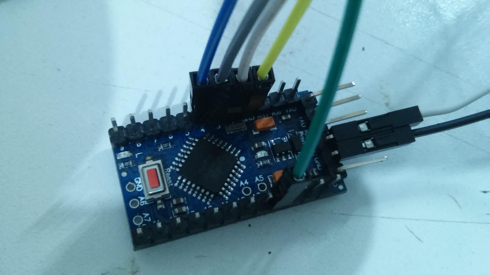
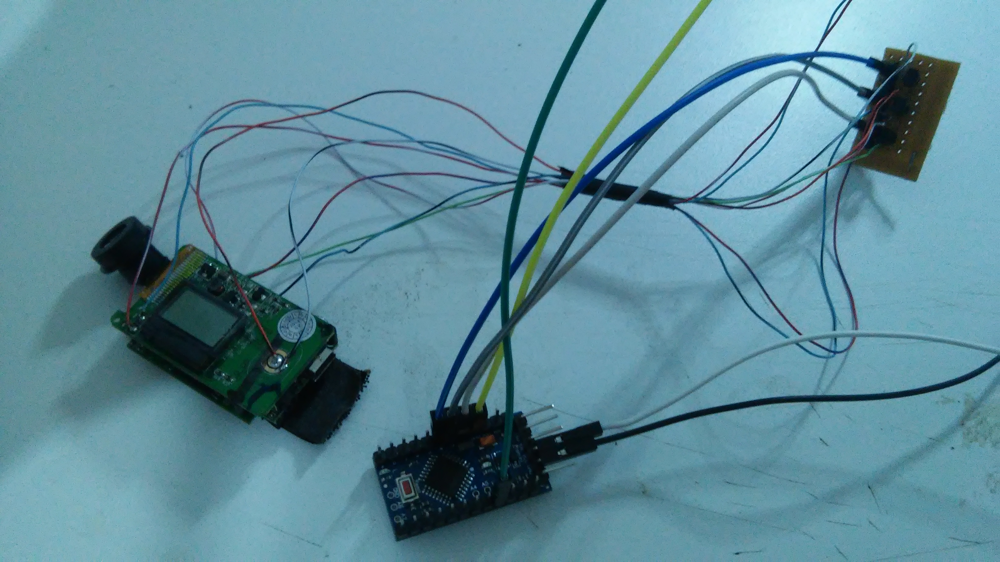

# Disparador de câmera - Arduino

Controle da câmera **NewLink - Sport Mini** via Arduino.

## Material

- 3x Transistor 2N3904
- Arduino
- Fios

## Montagem

- Abra a câmera, e solde um fio em cada lado dos _push buttons_ de cada função, ou seja, cada função terão dois fios soldados para fechar contato

- Em uma placa, o protoboard, ligue os três transístores, cada par de fios que você soldou no passo anterior, é ligado em um transistor, no emissor e no coletor - no caso, as pernas de cada lateral do transistor.

- O terminal do meio de cada transístor, é ligado em uma porta digital do arduino, neste caso, utilizei a porta 2, 3 e 4 (botão de disparo, botão de ligar/desligar e seleção de modo, respectivamente).

- Ao final você terá algo parecido com isso:

- Você pode ver funcionando no link abaixo:

